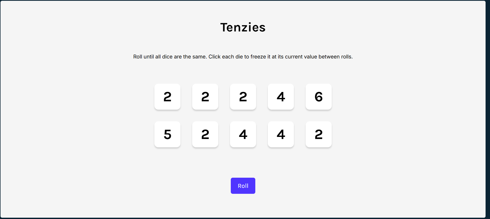

# 🎲 Tenzzies Game

<p align="center">
  
  
  
  
</p>

A fun and interactive dice game built with **React + Vite**. Roll 10 dice, hold your favorites, and try to get them all showing the same number to win!

📁 **Repo:** [Tenzzies](https://github.com/Rohan-Adhav/Tenzzies.git)  
🌐 **Live Demo:** [tenzzies-chi.vercel.app](https://tenzzies-chi.vercel.app/)  
🛠️ **Tech Stack:** React, Vite, JavaScript, CSS

---

## 🚀 Features

- 🎲 Roll 10 dice with a single click  
- 🟢 Click dice to hold/unhold them  
- 🎯 Win when all dice show the same number  
- 🎉 Confetti animation on victory  
- 📱 Responsive design for all devices

---

## 📸 Preview

<p align="center">
  
</p>


---

## 📦 Installation

```bash
git clone https://github.com/Rohan-Adhav/Tenzzies.git
cd Tenzzies
npm install
npm run dev
